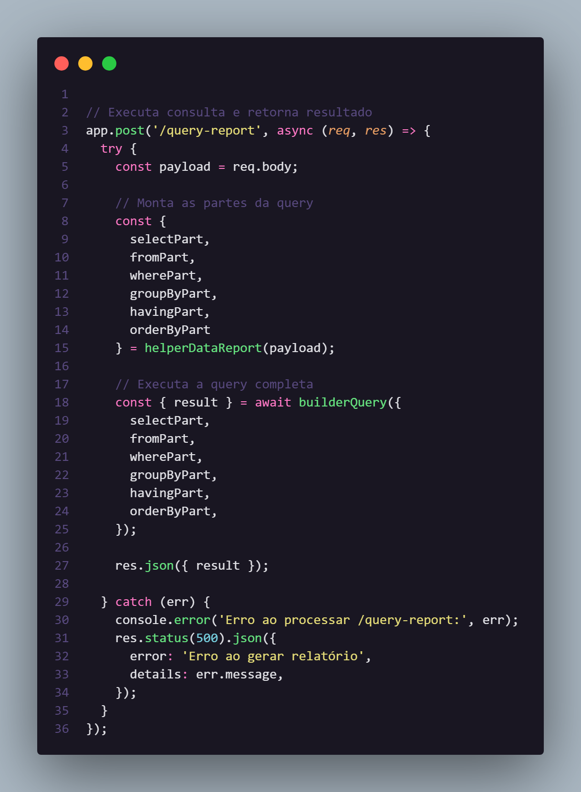
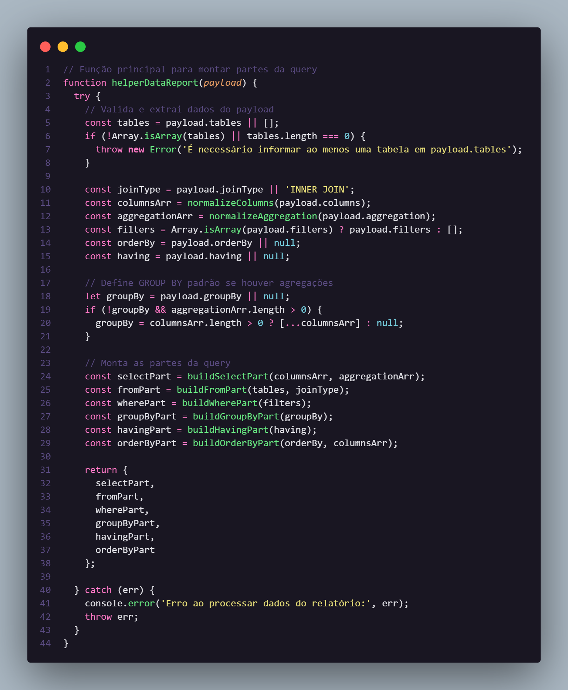
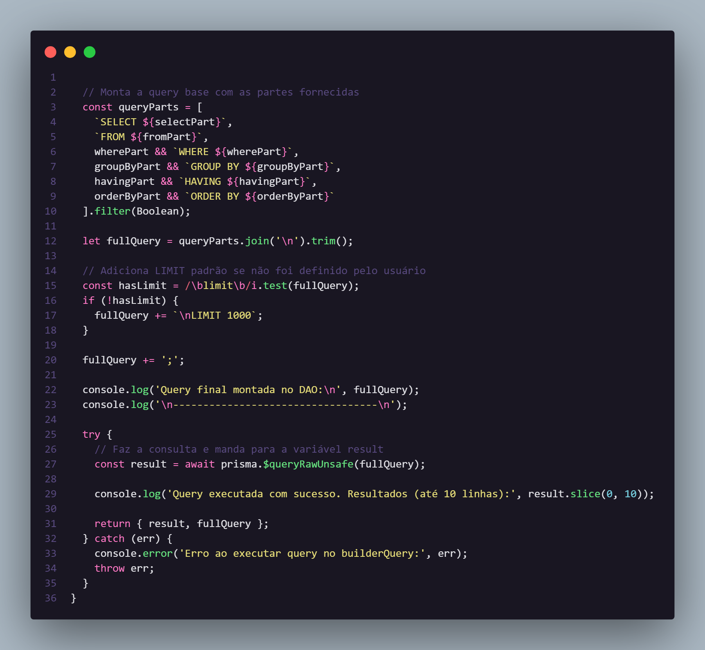
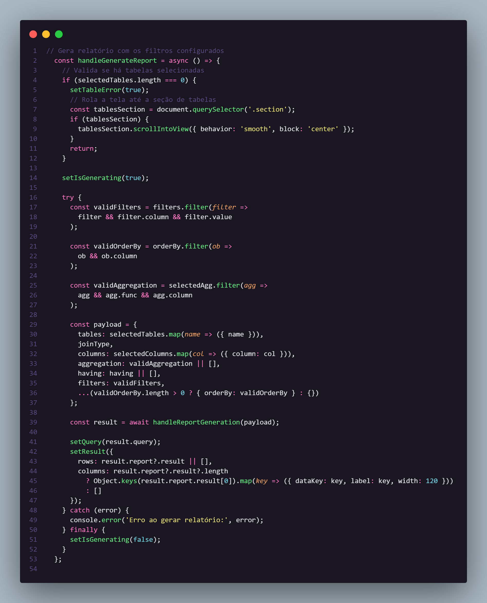
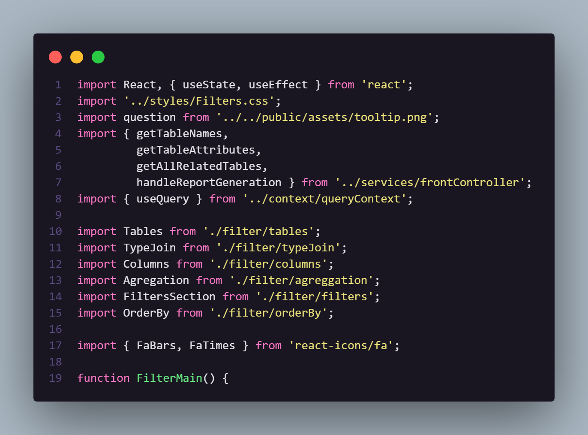
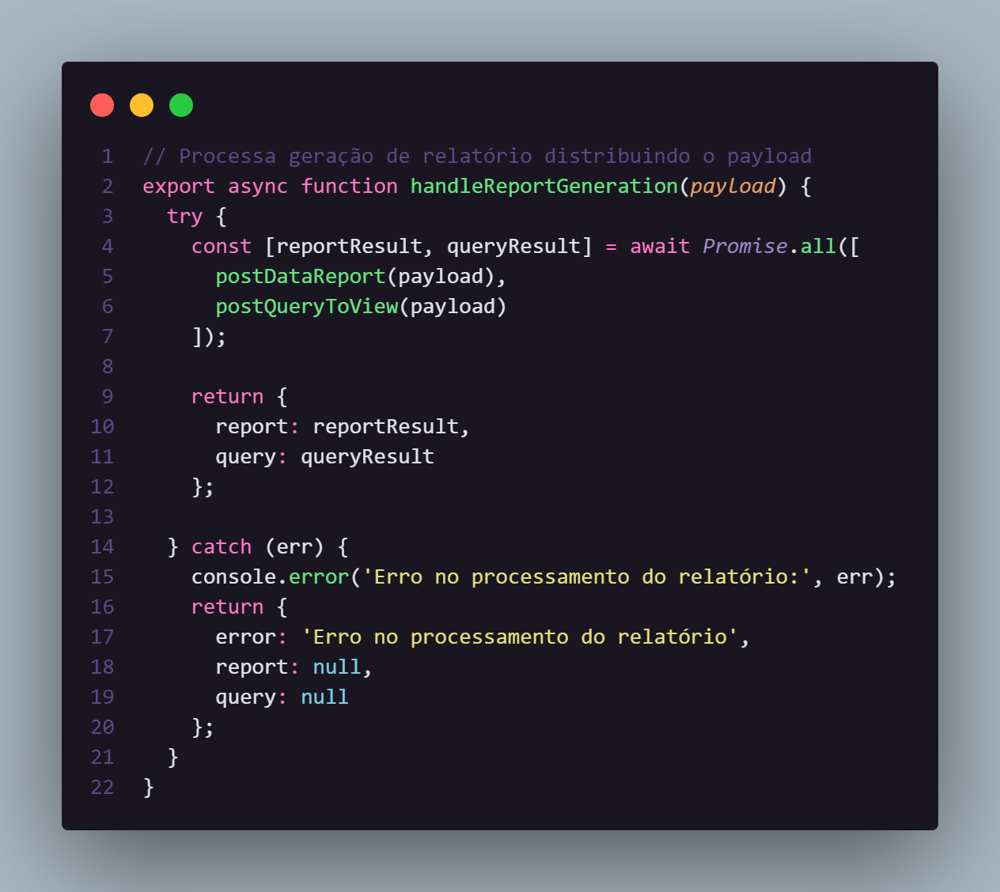
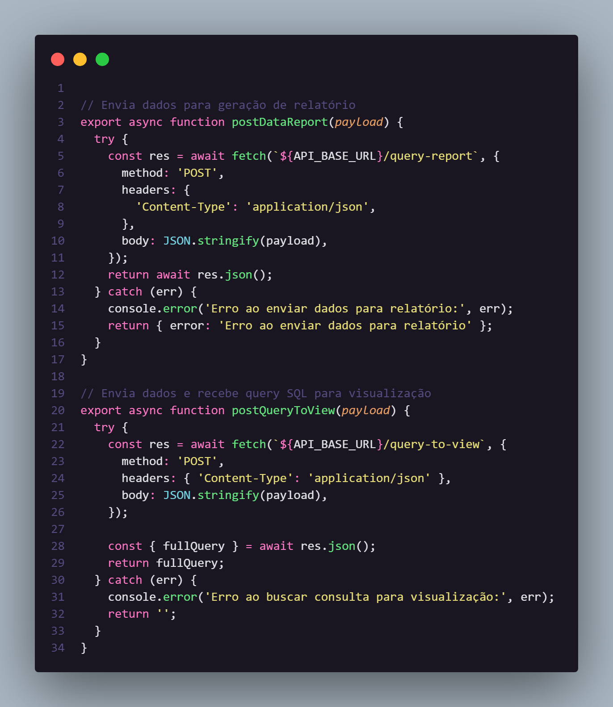
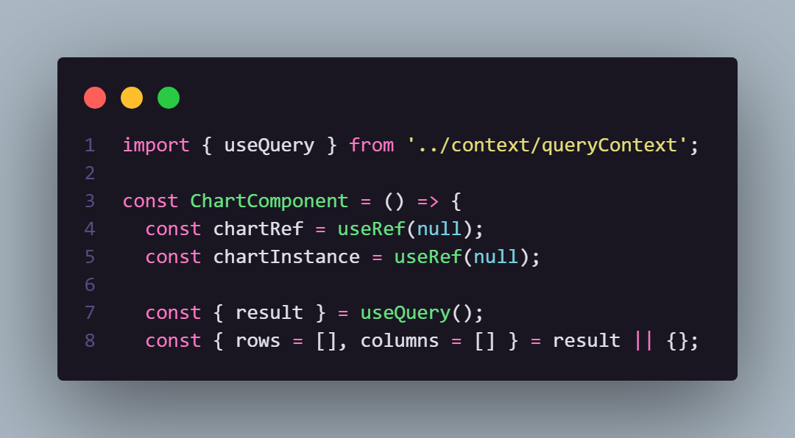
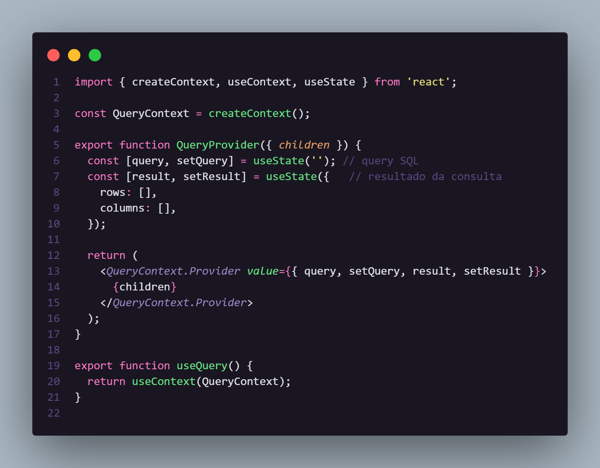

# Entendendo decisões arquiteturais e a estrutura do projeto

## Estrutura conceitual do projeto

O sistema foi dividido em **duas camadas principais**:

* **Backend (`/back`)** – responsável pela lógica de negócio, consultas SQL e integração com o banco de dados PostgreSQL.
* **Frontend (`/App`)** – interface React que gera, envia e exibe relatórios.

Abaixo estão as partes mais importantes do código e o que acontece em cada uma delas.

---

## Backend

### 1. `back/index.js` — Principais rotas do backend e base do servidor


O arquivo **index.js** inicializa o servidor Express, configura CORS e define as rotas principais (por exemplo, `/query-report` para geração de relatórios).

Esta rota recebe o payload gerado no frontend e envia para a função no `back/backController.js` chamada `helperDataReport`.



**Explicação:**

* Define o middleware `express.json()` para interpretar o corpo das requisições.
* As rotas direcionam as requisições para os controladores no `backController.js`.
* Escuta na porta definida (ex.: 5000).

---

### 2. `back/backController.js` — Tratamento e limpeza de dados

Este módulo é responsável por **processar o payload** vindo do frontend antes de passá-lo para a camada de acesso ao banco.
Ele valida, normaliza e garante que as instruções SQL sejam seguras.



**Explicação:**

* Extrai informações do payload (tabelas, colunas, joins, agregações etc.).
* Remove campos inválidos ou vazios.
* Monta o objeto final de consulta e chama a função `builderQuery` no `back/DAO/BDmain.js` para realizar a consulta em si.
* Retorna os resultados já filtrados ao frontend.

---

### 3. `back/DAO/BDmain.js` — Acesso ao banco de dados PostgreSQL

Esse componente é o **núcleo das consultas SQL**.
Recebe o payload já tratado e executa a consulta via Prisma ou `queryRaw`.



**Explicação:**

* Usa `prisma.$queryRaw()` para executar consultas dinâmicas.
* Recebe parâmetros do controlador e monta joins, filtros e agregações.
* Retorna resultados em formato JSON, que serão enviados ao frontend.

---

## Frontend

### 1. `src/components/filterMain.jsx` — Construção do payload

Este é o **componente central** da parte de filtros.
Ele coleta todas as informações selecionadas pelo usuário (tabelas, colunas, filtros, agregações, joins) e monta o **payload JSON** que será enviado ao backend.



**Explicação:**

* Coleta valores de todos os componentes filhos (`tables`, `columns`, `filters`, `aggregation`, `orderBy`, `typeJoin`).
* Monta o payload com a estrutura:

  ```js
  {
    tables: [{ name }],
    columns: [{ column }],
    aggregation: [...],
    filters: [...],
    having: [...],
    orderBy: [...]
  }
  ```
* Envia via `fetch` e/ou `axios` para o endpoint `/query-report` do backend com o arquivo `src/services/frontController.js`.

  Vale ressaltar que `src/components/filterMain.jsx` é o **principal componente** em relação a todos os filtros que se pode aplicar.
Portanto, esse componente importa os outros componentes que irão compor o mesmo. Todos esses componentes estão presentes em `src/components/filter/`



---

### 2. `src/services/frontController.js` — Comunicação com o back

Esse módulo é responsável por **enviar o payload do frontend para o backend** e receber as respostas de geração de relatório e visualização de query.
Ele é utilizado no componente `src/components/filterMain.jsx` no momento em que o usuário clica para gerar um relatório.



**Explicação:**

A função principal `handleReportGeneration(payload)` atua como **um distribuidor de tarefas**.
Quando o usuário solicita um relatório, o payload é recebido e **encaminhado simultaneamente para duas funções filhas**:

1. **`postDataReport(payload)`** — envia os dados para o endpoint `/query-report` do backend, que processa o relatório e retorna os resultados prontos.
2. **`postQueryToView(payload)`** — envia o mesmo payload para o endpoint `/query-to-view`, responsável por gerar a **string SQL completa** da consulta que foi executada, permitindo exibir ou depurar o comando gerado.

Essas duas funções são executadas em paralelo com `Promise.all`, otimizando o tempo de resposta.

**Fluxo resumido:**

```
Usuário → filterMain.jsx → handleReportGeneration(payload)
        ↳ postDataReport(payload) → /query-report → dados do relatório
        ↳ postQueryToView(payload) → /query-to-view → string SQL
```



**Comportamento técnico:**

* O arquivo define a URL base da API (`API_BASE_URL`).
* Utiliza `fetch` com método `POST` e corpo em JSON.
* Cada função trata erros localmente, garantindo que mesmo falhas parciais não interrompam o fluxo principal.
* O retorno final contém ambos os resultados (`report` e `query`), organizados em um objeto.

---

### 3. `src/components/chart.jsx` — Visualização de dados

Este componente utiliza **Chart.js** para gerar gráficos interativos baseados nos dados retornados pelo backend.



**Explicação:**

* Recebe os dados processados e o tipo de gráfico (barras, linhas etc.).
* Converte os valores do JSON em labels e datasets compatíveis com o Chart.js.
* Renderiza automaticamente o gráfico após a resposta da API.

---

### 4. `src/context/queryContext.jsx` — Estado global das consultas

O **QueryContext** armazena os estados globais das seleções e resultados.
Assim, diferentes componentes (tabela, gráfico, código SQL) podem reagir às mudanças de forma sincronizada.



**Explicação:**

* Usa `React.createContext()` para compartilhar estado entre componentes.
* Controla dados como: tabelas selecionadas, colunas, resultados e SQL gerado.
* Facilita a comunicação sem necessidade de props em cadeia.

---

### 5. `src/components/table.jsx` — Exibição dos resultados

Responsável por renderizar a tabela de resultados vinda do back.
Utiliza os dados retornados pelo `src/services/frontController`.

**Explicação:**

* Recebe os dados JSON do backend.
* Cria cabeçalhos e linhas automaticamente com base nas chaves do objeto.
* Atualiza em tempo real quando uma nova consulta é executada.

---

## Fluxo completo dos dados

**Insira aqui um diagrama mostrando o fluxo geral (Frontend → Backend → Banco).**

**Resumo do fluxo:**

1. O usuário seleciona tabelas e filtros no frontend.
2. O `filterMain.jsx` monta o payload JSON.
3. O `frontController.js` envia o payload para a rota `/query-report`.
4. O `backController.js` valida e limpa os dados.
5. O `BDmain.js` executa a query montada em `helperDataReport.js`.
6. O resultado é retornado ao frontend.
7. O gráfico e a tabela são renderizados com os novos dados.

---

## Boas práticas de contribuição

* Mantenha a separação entre **frontend** e **backend**.
* Sempre explique alterações no commit.
* Teste o fluxo completo (gerar relatório → ver gráfico → exibir SQL).
* Prefira criar novos componentes em `src/components` para novas funcionalidades.

