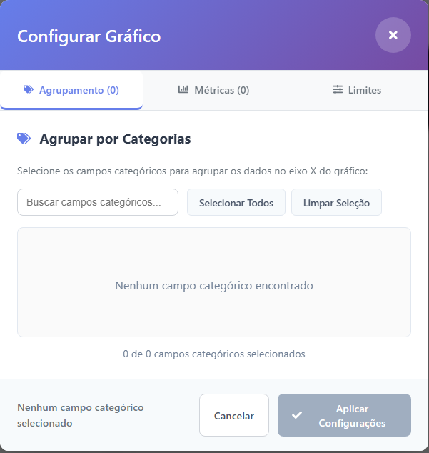

# Entendendo decisões arquiteturais e a estrutura do projeto

## Estrutura conceitual do projeto

O sistema foi dividido em **duas camadas principais**:

* **Backend (`/back`)** – responsável pela lógica de negócio, consultas SQL e integração com o banco de dados PostgreSQL.
* **Frontend (`/App`)** – interface React que gera, envia e exibe relatórios.

Abaixo estão as partes mais importantes do código e o que acontece em cada uma delas.

---

## Backend

### 1. `back/index.js` — Principais rotas do backend e base do servidor

```js
// Configuração do servidor
const express = require('express');
const cors = require('cors');
const app = express();
const PORT = process.env.PORT || 5000;

app.use(cors());
app.use(express.json());
```

O arquivo **index.js** inicializa o servidor Express, configura CORS e define as rotas principais (por exemplo, `/query-report` para geração de relatórios).

Esta rota recebe o payload gerado no frontend e envia para a função no `back/backController.js` chamada `helperDataReport`.


```js
// Executa consulta e retorna resultado
app.post('/query-report', async (req, res) => {
  try {
    const payload = req.body;

    // Monta as partes da query
    const {
      selectPart,
      fromPart,
      wherePart,
      groupByPart,
      havingPart,
      orderByPart
    } = helperDataReport(payload);

    // Executa a query completa
    const { result } = await builderQuery({
      selectPart,
      fromPart,
      wherePart,
      groupByPart,
      havingPart,
      orderByPart,
    });

    res.json({ result });

  } catch (err) {
    console.error('Erro ao processar /query-report:', err);
    res.status(500).json({
      error: 'Erro ao gerar relatório',
      details: err.message,
    });
  }
});
```

**Explicação:**

* Define o middleware `express.json()` para interpretar o corpo das requisições.
* As rotas direcionam as requisições para os controladores no `backController.js`.
* Escuta na porta definida (ex.: 5000).

---

### 2. `back/backController.js` — Tratamento e limpeza de dados

Este módulo é responsável por **processar o payload** vindo do frontend antes de passá-lo para a camada de acesso ao banco.
Ele valida, normaliza e garante que as instruções SQL sejam seguras.


```js
// Função principal para montar partes da query
function helperDataReport(payload) {
  try {
    // Valida e extrai dados do payload
    const tables = payload.tables || [];
    if (!Array.isArray(tables) || tables.length === 0) {
      throw new Error('É necessário informar ao menos uma tabela em payload.tables');
    }

    const joinType = payload.joinType || 'INNER JOIN';
    const columnsArr = normalizeColumns(payload.columns);
    const aggregationArr = normalizeAggregation(payload.aggregation);
    const filters = Array.isArray(payload.filters) ? payload.filters : [];
    const orderBy = payload.orderBy || null;
    const having = payload.having || null;
    
    // Define GROUP BY padrão se houver agregações
    let groupBy = payload.groupBy || null;
    if (!groupBy && aggregationArr.length > 0) {
      groupBy = columnsArr.length > 0 ? [...columnsArr] : null;
    }

    // Monta as partes da query
    const selectPart = buildSelectPart(columnsArr, aggregationArr);
    const fromPart = buildFromPart(tables, joinType);
    const wherePart = buildWherePart(filters);
    const groupByPart = buildGroupByPart(groupBy);
    const havingPart = buildHavingPart(having);
    const orderByPart = buildOrderByPart(orderBy, columnsArr);

    return {
      selectPart,
      fromPart,
      wherePart,
      groupByPart,
      havingPart,
      orderByPart
    };

  } catch (err) {
    console.error('Erro ao processar dados do relatório:', err);
    throw err;
  }
}
```

**Explicação:**

* Extrai informações do payload (tabelas, colunas, joins, agregações etc.).
* Remove campos inválidos ou vazios.
* Monta o objeto final de consulta e chama a função `builderQuery` no `back/DAO/BDmain.js` para realizar a consulta em si.
* Retorna os resultados já filtrados ao frontend.

---

### 3. `back/DAO/BDmain.js` — Acesso ao banco de dados PostgreSQL

Esse componente é o **núcleo das consultas SQL**.
Recebe o payload já tratado e executa a consulta via Prisma ou `queryRaw`.


```js
// Monta a query base com as partes fornecidas
const queryParts = [
  `SELECT ${selectPart}`,
  `FROM ${fromPart}`,
  wherePart && `WHERE ${wherePart}`,
  groupByPart && `GROUP BY ${groupByPart}`,
  havingPart && `HAVING ${havingPart}`,
  orderByPart && `ORDER BY ${orderByPart}`
].filter(Boolean);

let fullQuery = queryParts.join('\n').trim();

// Adiciona LIMIT padrão se não foi definido pelo usuário
const hasLimit = /\blimit\b/i.test(fullQuery);
if (!hasLimit) {
  fullQuery += `\nLIMIT 1000`;
}

fullQuery += ';';

console.log('Query final montada no DAO:\n', fullQuery);
console.log('\n----------------------------------\n');

try {
  // Faz a consulta e manda para a variável result
  const result = await prisma.$queryRawUnsafe(fullQuery);

  console.log('Query executada com sucesso. Resultados (até 10 linhas):', result.slice(0, 10));

  return { result, fullQuery };
} catch (err) {
  console.error('Erro ao executar query no builderQuery:', err);
  throw err;
}
```

**Explicação:**

* Usa `prisma.$queryRaw()` para executar consultas dinâmicas.
* Recebe parâmetros do controlador e monta joins, filtros e agregações.
* Retorna resultados em formato JSON, que serão enviados ao frontend.

---

## Frontend

### 1. `src/components/filterMain.jsx` — Construção do payload

Este é o **componente central** da parte de filtros.
Ele coleta todas as informações selecionadas pelo usuário (tabelas, colunas, filtros, agregações, joins) e monta o **payload JSON** que será enviado ao backend.


```js
// Gera relatório com os filtros configurados
const handleGenerateReport = async () => {
  // Valida se há tabelas selecionadas
  if (selectedTables.length === 0) {
    setTableError(true);
    // Rola a tela até a seção de tabelas
    const tablesSection = document.querySelector('.section');
    if (tablesSection) {
      tablesSection.scrollIntoView({ behavior: 'smooth', block: 'center' });
    }
    return;
  }

  setIsGenerating(true);
  
  try {
    const validFilters = filters.filter(filter => 
      filter && filter.column && filter.value
    );
    
    const validOrderBy = orderBy.filter(ob => 
      ob && ob.column
    );

    const validAggregation = selectedAgg.filter(agg => 
      agg && agg.func && agg.column
    );

    const payload = {
      tables: selectedTables.map(name => ({ name })),
      joinType,
      columns: selectedColumns.map(col => ({ column: col })),
      aggregation: validAggregation || [], 
      having: having || [],
      filters: validFilters,
      ...(validOrderBy.length > 0 ? { orderBy: validOrderBy } : {})
    };

    const result = await handleReportGeneration(payload);

    setQuery(result.query);
    setResult({
      rows: result.report?.result || [],
      columns: result.report?.result?.length
        ? Object.keys(result.report.result[0]).map(key => ({ dataKey: key, label: key, width: 120 }))
        : []
    });
  } catch (error) {
    console.error('Erro ao gerar relatório:', error);
  } finally {
    setIsGenerating(false);
  }
};
```

**Explicação:**

* Coleta valores de todos os componentes filhos (`tables`, `columns`, `filters`, `aggregation`, `orderBy`, `typeJoin`).
* Monta o payload com a estrutura:

  ```js
  {
    tables: [{ name }],
    columns: [{ column }],
    aggregation: [...],
    filters: [...],
    having: [...],
    orderBy: [...]
  }
  ```
* Envia via `fetch` e/ou `axios` para o endpoint `/query-report` do backend com o arquivo `src/services/frontController.js`.

  Vale ressaltar que `src/components/filterMain.jsx` é o **principal componente** em relação a todos os filtros que se pode aplicar.
Portanto, esse componente importa os outros componentes que irão compor o mesmo. Todos esses componentes estão presentes em `src/components/filter/`


```js
import React, { useState, useEffect } from 'react';
import '../styles/Filters.css';
import question from '../../public/assets/tooltip.png';
import { getTableNames, 
         getTableAttributes, 
         getAllRelatedTables, 
         handleReportGeneration } from '../services/frontController';
import { useQuery } from '../context/queryContext';

import Tables from './filter/tables';
import TypeJoin from './filter/typeJoin';
import Columns from './filter/columns';
import Agregation from './filter/agreggation';
import FiltersSection from './filter/filters';
import OrderBy from './filter/orderBy';

import { FaBars, FaTimes } from 'react-icons/fa';

function FilterMain() {
```

---

Perfeito! Podemos atualizar a seção do `frontController.js` para incluir que ele também **traduz os nomes de tabelas e colunas** e possui funções que consultam o backend para obtê-los. Aqui está a versão revisada:

---

### 2. `src/services/frontController.js` — Comunicação com o backend e tradução de nomes

Esse módulo é responsável por **enviar o payload do frontend para o backend**, receber as respostas de geração de relatório e visualização de query, **e traduzir os nomes das tabelas e colunas** para exibição amigável na interface.
Ele é utilizado no componente `src/components/filterMain.jsx` quando o usuário solicita a geração de um relatório.


```js
// Processa geração de relatório distribuindo o payload
export async function handleReportGeneration(payload) {
  try {
    const [reportResult, queryResult] = await Promise.all([
      postDataReport(payload),
      postQueryToView(payload)
    ]);

    return {
      report: reportResult,
      query: queryResult
    };

  } catch (err) {
    console.error('Erro no processamento do relatório:', err);
    return { 
      error: 'Erro no processamento do relatório',
      report: null,
      query: null
    };
  }
}
```

**Principais funções de consulta ao backend:**

```js
// Busca nomes das tabelas do banco de dados
export async function getTableNames() {
  if (cachedTableNames) return cachedTableNames;

  try {
    const res = await fetch(`${API_BASE_URL}/tables`);
    cachedTableNames = await res.json();
    return cachedTableNames;
  } catch (err) {
    console.error('Erro ao buscar tabelas:', err);
    return [];
  }
}

// Busca todas as relações entre tabelas
export async function getAllRelatedTables() {
  if (cachedRelations) return cachedRelations;

  try {
    const res = await fetch(`${API_BASE_URL}/all-related-tables`);
    const data = await res.json();

    cachedRelations = {};
    data.forEach(rel => {
      if (!cachedRelations[rel.table_name]) cachedRelations[rel.table_name] = [];
      if (!cachedRelations[rel.related_table]) cachedRelations[rel.related_table] = [];

      cachedRelations[rel.table_name].push(rel.related_table);
      cachedRelations[rel.related_table].push(rel.table_name);
    });

    return cachedRelations;
  } catch (err) {
    console.error('Erro ao buscar relações:', err);
    return {};
  }
}

// Busca atributos (colunas) de uma tabela específica
export async function getTableAttributes(tableName) {
  try {
    const res = await fetch(`${API_BASE_URL}/attributes/${tableName}`);
    return await res.json();
  } catch (err) {
    console.error('Erro ao buscar atributos:', err);
    return [];
  }
}
```

**Explicação:**

A função principal `handleReportGeneration(payload)` atua como **um distribuidor de tarefas**. Quando o usuário solicita um relatório, o payload é recebido e **encaminhado simultaneamente para duas funções filhas**:

1. **`postDataReport(payload)`** — envia os dados para o endpoint `/query-report` do backend, que processa o relatório e retorna os resultados prontos.
2. **`postQueryToView(payload)`** — envia o mesmo payload para o endpoint `/query-to-view`, responsável por gerar a **string SQL completa** da consulta executada, permitindo exibir ou depurar o comando gerado.

Essas duas funções são executadas em paralelo com `Promise.all`, otimizando o tempo de resposta.

**Fluxo resumido:**

```
Usuário → filterMain.jsx → handleReportGeneration(payload)
        ↳ postDataReport(payload) → /query-report → dados do relatório
        ↳ postQueryToView(payload) → /query-to-view → string SQL
```
```js 
// Envia dados para geração de relatório
export async function postDataReport(payload) {
  try {
    const res = await fetch(`${API_BASE_URL}/query-report`, {
      method: 'POST',
      headers: {
        'Content-Type': 'application/json',
      },
      body: JSON.stringify(payload),
    });
    return await res.json();
  } catch (err) {
    console.error('Erro ao enviar dados para relatório:', err);
    return { error: 'Erro ao enviar dados para relatório' };
  }
}

// Envia dados e recebe query SQL para visualização
export async function postQueryToView(payload) {
  try {
    const res = await fetch(`${API_BASE_URL}/query-to-view`, {
      method: 'POST',
      headers: { 'Content-Type': 'application/json' },
      body: JSON.stringify(payload),
    });

    const { fullQuery } = await res.json();
    return fullQuery;
  } catch (err) {
    console.error('Erro ao buscar consulta para visualização:', err);
    return '';
  }
}
```

**Comportamento técnico:**

* Define a URL base da API (`API_BASE_URL`).
* Traduz nomes de tabelas e colunas para exibição amigável.
* Busca tabelas (`getTableNames`), relações (`getAllRelatedTables`) e colunas (`getTableAttributes`) diretamente do backend.
* Utiliza `fetch` com método `POST` e corpo em JSON.
* Cada função trata erros localmente, garantindo que falhas parciais não interrompam o fluxo.
* O retorno final contém ambos os resultados (`report` e `query`), organizados em um objeto.

---

### 3. `src/components/chart.jsx` — Visualização de dados

Este componente utiliza **Chart.js** para gerar gráficos interativos baseados nos dados retornados pelo backend.


```js
import { useQuery } from '../context/queryContext';

const ChartComponent = () => {
  const chartRef = useRef(null);
  const chartInstance = useRef(null);

  const { result } = useQuery();
  const { rows = [], columns = [] } = result || {};
```

**Explicação:**

* Recebe os dados processados e o tipo de gráfico (barras, linhas etc.).
* Converte os valores do JSON em labels e datasets compatíveis com o Chart.js.
* Renderiza automaticamente o gráfico após a resposta da API.

---

### 4. `src/context/queryContext.jsx` — Estado global das consultas

O **QueryContext** armazena os estados globais das seleções e resultados.
Assim, diferentes componentes (tabela, gráfico, código SQL) podem reagir às mudanças de forma sincronizada.


```js
import { createContext, useContext, useState } from 'react';

const QueryContext = createContext();

export function QueryProvider({ children }) {
  const [query, setQuery] = useState(''); // query SQL
  const [result, setResult] = useState({   // resultado da consulta
    rows: [],
    columns: [],
  });

  return (
    <QueryContext.Provider value={{ query, setQuery, result, setResult }}>
      {children}
    </QueryContext.Provider>
  );
}

export function useQuery() {
  return useContext(QueryContext);
}
```

**Explicação:**

* Usa `React.createContext()` para compartilhar estado entre componentes.
* Controla dados como: tabelas selecionadas, colunas, resultados e SQL gerado.
* Facilita a comunicação sem necessidade de props em cadeia.

---

### 5. `src/components/table.jsx` — Exibição dos resultados

Responsável por renderizar a tabela de resultados vinda do back.
Utiliza os dados retornados pelo `src/services/frontController`.

**Explicação:**

* Recebe os dados JSON do backend.
* Cria cabeçalhos e linhas automaticamente com base nas chaves do objeto.
* Atualiza em tempo real quando uma nova consulta é executada.

---

Perfeito! Aqui está uma explicação detalhada do `ModalChart.jsx` que você pode adicionar ao README ou à documentação:

---

### 6. `src/components/modalChart.jsx` — Filtros para o gráfico

O **`ModalChart`** é um componente que fornece **uma interface de configuração para os gráficos**, permitindo ao usuário escolher quais categorias e quais colunas de valores deseja visualizar.



**Como o componente funciona:**

* Ele **não recebe dados inteiros diretamente do banco de dados**. Em vez disso, recebe **apenas os dados filtrados e processados pela consulta que o usuário realizou**, que foram retornados pelo backend através do `frontController` e do `chart.jsx`.
* O componente é controlado pelo **pai `chart.jsx`**, que passa várias props:

```js
<ModalChart
  isOpen={modalOpen}
  onClose={handleModalClose}
  selectedCategories={selectedCategories}
  onCategoriesChange={handleCategoriesChange}
  columns={columns}
  selectedValueColumns={selectedValueColumns}
  onValueColumnsChange={handleValueColumnsChange}
  rows={rows}
/>
```

* **Props principais:**

  * `isOpen`: controla se o modal está visível.
  * `onClose`: função para fechar o modal.
  * `selectedCategories` / `onCategoriesChange`: categorias atualmente selecionadas e função para atualizar a seleção.
  * `columns`: todas as colunas disponíveis na consulta.
  * `selectedValueColumns` / `onValueColumnsChange`: colunas de valores selecionadas e função para atualizar a seleção.
  * `rows`: dados da consulta que serão filtrados e exibidos no gráfico.

* **Estado interno do ModalChart:**

  * `localSelectedCategories` e `localSelectedValueColumns`: mantêm a seleção temporária enquanto o modal está aberto.
  * `searchTerm`: filtro de pesquisa para encontrar categorias ou colunas rapidamente.
  * `activeTab`: controla a aba ativa do modal (por exemplo, categorias ou valores).
  * `maxItems` e `sortBy`: controlam a quantidade máxima de itens e a ordenação dentro do gráfico.


**Resumo técnico:**

* O `ModalChart` funciona como **um intermediário de configuração**, nunca acessando o banco diretamente.
* Ele depende do **estado e dos dados fornecidos pelo pai (`chart.jsx`)**, garantindo que o modal reflita **somente os resultados da consulta atual**.
* A interface inclui busca, ordenação e limitação de itens, tornando o processo de filtragem de dados mais intuitivo para o usuário.
* A parte de **Agrupamento** agrupa os valores numéricos somente com base em dados categóricos retornados na consulta.
* Já parte de **Métricas** diz respeito a dados numéricos.

---


## Fluxo completo dos dados


**Resumo do fluxo:**

1. O usuário seleciona tabelas e filtros no frontend.
2. O `filterMain.jsx` monta o payload JSON.
3. O `frontController.js` envia o payload para a rota `/query-report`.
4. O `backController.js` valida e limpa os dados.
5. O `BDmain.js` executa a query montada em `helperDataReport.js`.
6. O resultado é retornado ao frontend.
7. O gráfico e a tabela são renderizados com os novos dados.

---

## Boas práticas de contribuição

* Mantenha a separação entre **frontend** e **backend**.
* Sempre explique alterações no commit.
* Teste o fluxo completo (gerar relatório → ver gráfico → exibir SQL).
* Prefira criar novos componentes em `src/components` para novas funcionalidades.

